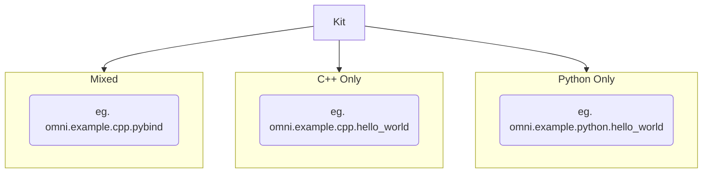

# Omniverse Kit C++ Extension Template

This project contains everything necessary to develop extensions that contain C++ code, along with a number of examples demonstrating best practices for creating them.

## What Are Extensions?

While an extension can consist of a single `extension.toml` file, most contain Python code, C++ code, or a mixture of both:

Extensive documentation detailing what extensions are and how they work can be found [here](https://docs.omniverse.nvidia.com/py/kit/docs/guide/extensions.html).

## Getting Started

1. Clone this repo to your local machine.
2. Open a command prompt and navigate to the root of your cloned repo.
3. Run `build.bat` to bootstrap your dev environment and build the example extensions.
4. Run `_build\windows-x86_64\release\omni.app.example.extension_browser.bat` to open an example kit application.
5. From the menu, select `Window->Extensions` to open the extension browser window.
6. Enter `omni.example.cpp` in the search bar at the top of the extension browser window to view the example extensions included with this repo.

## Debugging C++ Extensions

1. Run `build.bat` (if you haven't already) to generate the solution file.
2. Open `_compiler\vs2019\kit-extension-template-cpp.sln` using Visual Studio 2019.
3. Select `omni.app.example.extension_browser` as the startup project (if it isn't already).
4. Run/debug the example kit application, using the extension browser window to enable/disable extensions.

## Creating New C++ Extensions

1. Copy one of the existing extension examples to a new folder with the same name as your new extension (still within the `source/extensions` folder).
2. Update the fields in your new extension's `config/extension.toml` file as necessary.
3. Update your new extension's `premake5.lua` file as necessary.
4. Update your new extension's C++ code in the `plugins` folder as necessary.
5. Update your new extension's Python code in the `python` folder as necessary.
6. Update your new extension's Python bindings in the `bindings` folder as necessary.
7. Run `build.bat` to build your new extension.
8. Refer to the *Getting Started* section above to open the example kit application and extension browser window.
9. Enter the name of your new extension in the search bar at the top of the extension browser window to view it.

