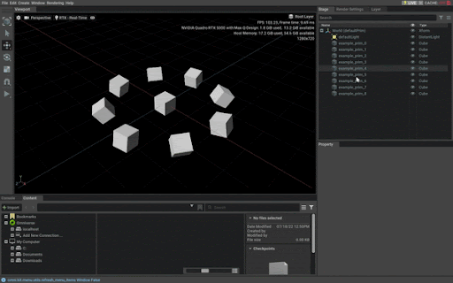

# Overview

An example C++ extension that can be used as a reference/template for creating new extensions.

Demonstrates how to create a C++ plugin that can interact with the current USD stage by:
- Subscribing to USD stage events from Python.
- Sending the current USD stage id to C++.
- Storing a reference to the USD stage in C++.
- Adding some prims to the USD stage from C++.
- Animating the USD prims each update from C++.
- Printing information about the USD stage from C++.

Note: It is important that all USD stage reads/writes happen from the main thread:

[https://graphics.pixar.com/usd/release/api/_usd__page__multi_threading.html](https://graphics.pixar.com/usd/release/api/_usd__page__multi_threading.html)

# Example

