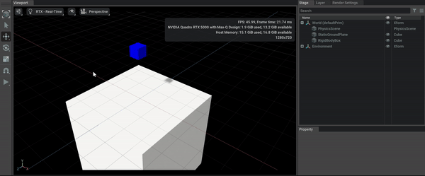

# Overview

An example C++ extension that can be used as a reference/template for creating new extensions.

Demonstrates how to create a C++ plugin that can add physics to the current USD stage by:
- Using the UsdStageCache to get a USD stage from C++.
- Adding a UsdPhysicsScene to the USD stage from C++.
- Adding a static body box to the USD stage from C++.
- Adding a rigid body box to the USD stage from C++.

Note: It is important that all USD stage reads/writes happen from the main thread:

[https://graphics.pixar.com/usd/release/api/_usd__page__multi_threading.html](https://graphics.pixar.com/usd/release/api/_usd__page__multi_threading.html)

# Example

